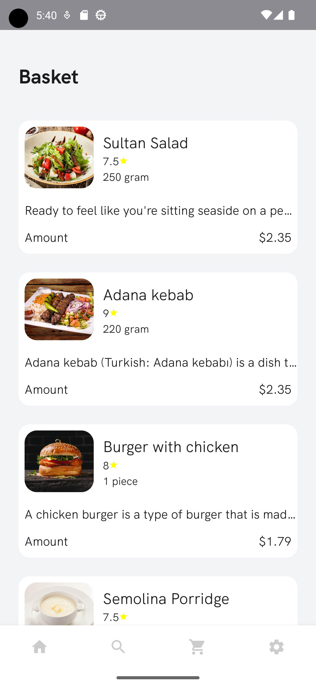

# This program is developed entirely in Kotlin, employing the principles of Clean Architecture following the MVVM pattern. It's divided into modules, facilitating easier scalability, dependency management, and ensuring high flexibility for incorporating changes. This approach allows for seamless addition of new features and modification of existing code without compromising the overall structure and performance of the application.

An innovative solution for efficient restaurant task management, crafted with Kotlin and powered by the cutting-edge Jetpack Compose framework. Seamlessly integrating modern design principles, this application streamlines restaurant operations, from order processing to table management. With its intuitive interface and dynamic features, it revolutionizes the way restaurants handle tasks, enhancing productivity and customer satisfaction.

## Screenshots

## Libraries 

* [Jetpack Compose](https://developer.android.com/jetpack/compose) Jetpack Compose is Android’s
  recommended modern toolkit for building native UI. It simplifies and accelerates UI development on
  Android. Quickly bring your app to life with less code, powerful tools, and intuitive Kotlin APIs.

* [Kotlin flows](https://developer.android.com/kotlin/flow) In coroutines, a flow is a type that can
  emit multiple values sequentially, as opposed to suspend functions that return only a single
  value. For example, you can use a flow to receive live updates from a database.

* [ViewModel](https://developer.android.com/topic/libraries/architecture/viewmodel) Data related to
  the user interface that is not destroyed when the application is rotated. Easily schedule
  asynchronous tasks for optimal execution.

* [Kotlin Coroutines](https://github.com/Kotlin/kotlinx.coroutines) Coroutines is a rich library for
  coroutines developed by JetBrains. It contains a number of high-level primitives with support for
  coroutines, which are discussed in this guide, including startup, asynchrony, and others.

* [Lifecycle](https://developer.android.com/topic/libraries/architecture/lifecycle) An interface
  that automatically responds to lifecycle events.

* [Hilt Destinations](https://developer.android.com/training/dependency-injection/hilt-android) 
  This library leverages Hilt to automatically process annotations and 
  generate code that integrates your application with Dagger Hilt.
  It helps reduce boilerplate code and simplifies dependency injection,
  ensuring reliable and efficient dependency injection in your application.

* [Back4App-Kit](https://www.back4app.com/)
  Back4App-Kit is a set of tools and utilities for integrating your application with the Back4App platform. 
  With it, you can easily interact with cloud services, manage data, 
  and implement your application's functionality without spending time on writing routine code.

* [Jetpack-Navigation-Magic](https://developer.android.com/guide/navigation/navcontroller)
  Jetpack-Navigation-Magic is a library that simplifies navigation in your application using Jetpack Navigation components.
  It automatically processes annotations and generates code,
  reducing the need to manually write navigation logic and allowing you to focus on app development.